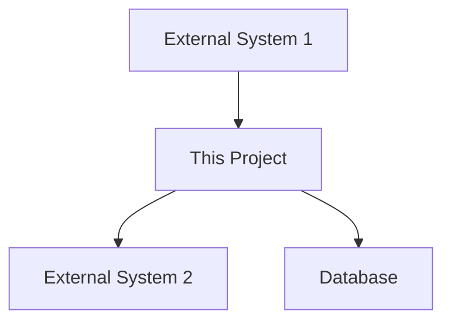
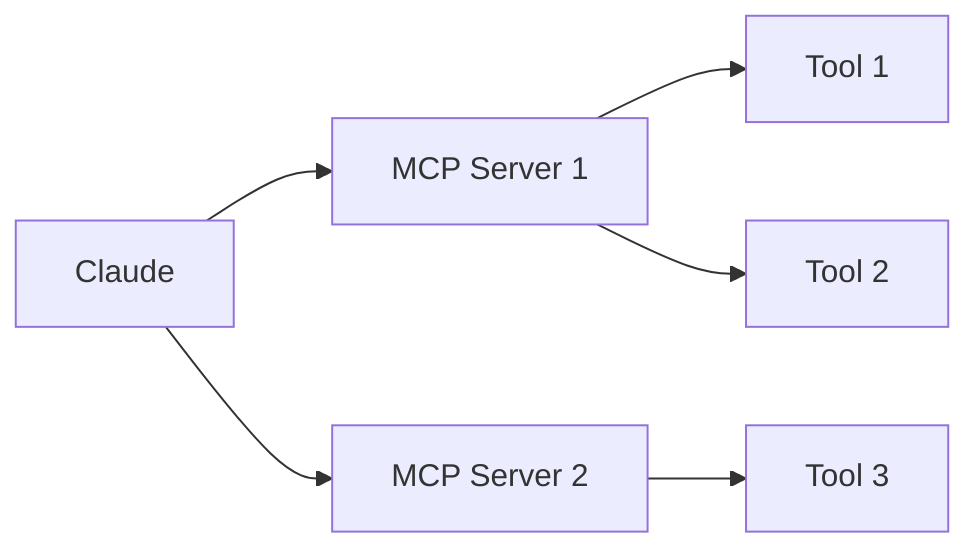
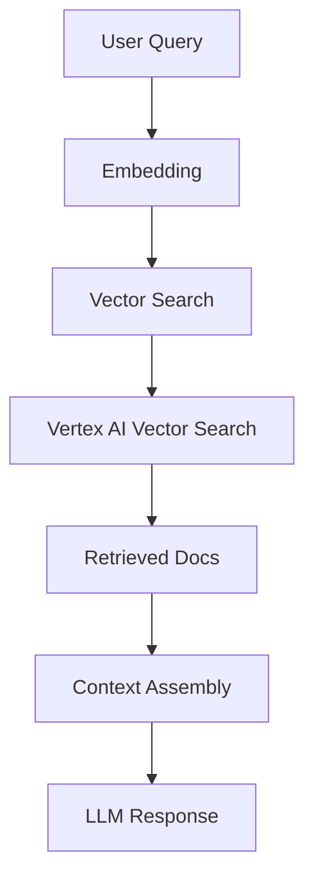
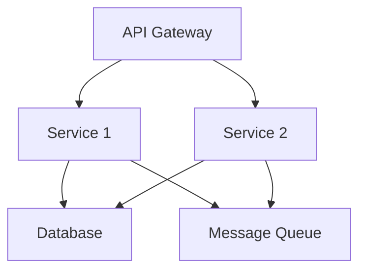

# Documentation Templates

This file contains comprehensive templates for all project documentation files. Each template has variants for different contexts (Python/Go, OpenSource/Internal, project types).

## Template Selection Guide

### By Language

- **Python**: Use `uv`, `pytest`, `ruff`, `pyproject.toml` references
- **Go**: Use `go.mod`, `go test`, `golangci-lint` references

### By Context

- **OpenSource**: Include badges, CODE_OF_CONDUCT, security policy, community guidelines
- **Internal/Work**: Include team chat channels, issue tracker references, internal tooling, compliance notes

### By Project Type

- **AI Agent**: MCP architecture, tool integrations, prompt patterns
- **Microservice**: API schemas, service dependencies, health checks
- **CLI Tool**: Installation methods, command examples, subcommands
- **Infrastructure**: Terraform/K8s setup, deployment procedures, DR plans
- **Library**: API reference, usage examples, integration guides

## Template Variants Reference

This table shows all language-specific variants available in this file:

| Section | Python Variant | Go Variant | Location |
|---------|---------------|------------|----------|
| README Quick Start | `PYTHON_QUICKSTART` | `GO_QUICKSTART` | Lines 70-117 |
| User Guide Installation | `PYTHON_INSTALLATION` | `GO_INSTALLATION` | Lines 555-587 |
| Developer Guide Setup | `PYTHON_DEV_SETUP` | `GO_DEV_SETUP` | Lines 954-978 |
| Test Examples | `PYTHON_TEST_EXAMPLE` | `GO_TEST_EXAMPLE` | Lines 932-1004 |
| Style Guidelines | `PYTHON_STYLE` | `GO_STYLE` | Lines 1236-1385 |
| Documentation Format | Python Docstrings | Go Comments | In style sections |

**How to use**: Each main template section uses placeholder tags like `[PYTHON_QUICKSTART or GO_QUICKSTART]`. The variants below provide the actual content to insert based on detected language.

---

## README.md Template

### Structure (All Projects)

```markdown
# {PROJECT_NAME}

{ONE_LINE_DESCRIPTION}

[BADGES - OpenSource only]
[](link)
[](link)
[](link)
[](link)

## Overview

{2-3 sentences explaining what the project does, why it exists, and who it's for}

## Features

- Feature 1 with brief explanation
- Feature 2 with brief explanation
- Feature 3 with brief explanation

## Quick Start

[PYTHON_QUICKSTART or GO_QUICKSTART]

## Documentation

- [Architecture](docs/ARCHITECTURE.md) - System design and components
- [Developer Guide](docs/DEVELOPER_GUIDE.md) - Development setup and contribution

## [CONTEXT_SPECIFIC_SECTIONS]

[For OpenSource: ## Community, ## Security, ## License]
[For Internal: ## Support, ## Compliance, ## Internal Resources]

## License

{LICENSE_INFO}
```

### Python Quick Start Variant

```markdown
## Quick Start

### Installation

```bash
# Using uv (recommended)
uv pip install {package_name}

# Or using pip
pip install {package_name}
```

### Basic Usage

```python
from {package_name} import {main_class}

# Example usage
{example_code}
```

```

### Go Quick Start Variant

```markdown
## Quick Start

### Installation

```bash
go install github.com/{org}/{project}@latest
```

### Basic Usage

```go
package main

import "{module_path}"

func main() {
    // Example usage
    {example_code}
}
```

```

### OpenSource Additional Sections

```markdown
## Community

- [Code of Conduct](CODE_OF_CONDUCT.md)
- [Security Policy](SECURITY.md)
- [Discussion Forum](link)
- [Issue Tracker](link)

## Contributing

We welcome contributions! Please see [CONTRIBUTING.md](docs/CONTRIBUTING.md) for guidelines.

## Support

- Documentation: [docs/](docs/)
- Issues: [GitHub Issues](link)
- Discussions: [GitHub Discussions](link)
```

### Internal/Work Additional Sections

```markdown
## Support

- Team Chat: #{team_channel}
- Issue Tracker: [{PROJECT_KEY}](issue_tracker_link)
- On-call: [Rotation schedule](link)

## Compliance

- DORA compliance: ✓
- Security review: [Review #{number}](link)
- Data classification: {classification}

## Internal Resources

- [Architecture Decision Records](docs/adr/)
- [Runbooks](docs/runbooks/)
- [Cloud Console](https://console.cloud.provider.com/project={project_id})
```

---

## ARCHITECTURE.md Template

### Structure (All Projects)

```markdown
# Architecture

## Overview

{High-level description of the system architecture in 2-3 paragraphs}

## System Context

[DIAGRAM - can be Mermaid, ASCII art, or reference to external diagram]



## Components

### Component 1: {Name}

**Purpose**: {What this component does}

**Responsibilities**:

- Responsibility 1
- Responsibility 2

**Technology**: {Language, framework, key libraries}

**Interfaces**: {APIs, events, data formats}

### Component 2: {Name}

{Repeat structure}

## Data Flow

{Explain how data moves through the system}

[DIAGRAM showing data flow]

## [PROJECT_TYPE_SPECIFIC_SECTIONS]

[For AI Agents: ## MCP Architecture, ## Tool Integrations, ## RAG Pipeline]
[For Microservices: ## Service Dependencies, ## API Contracts, ## Event Schemas]
[For Infrastructure: ## Cloud Resources, ## Network Architecture, ## Deployment Model]

## Key Design Decisions

### Decision 1: {Title}

**Context**: {Why this decision was needed}

**Decision**: {What was decided}

**Rationale**: {Why this approach was chosen}

**Alternatives Considered**: {What else was considered and why it wasn't chosen}

### Decision 2: {Title}

{Repeat structure}

## Technology Stack

- **Language**: {Language and version}
- **Framework**: {Framework and version}
- **Database**: {Database type and version}
- **Infrastructure**: {Cloud provider, key services}
- **Key Dependencies**: {Critical libraries}

## Non-Functional Requirements

- **Performance**: {Performance targets and characteristics}
- **Scalability**: {How the system scales}
- **Reliability**: {Availability targets, failure handling}
- **Security**: {Security measures, authentication, authorization}

## Deployment Architecture

[DIAGRAM of deployment]

{Description of how the system is deployed}

## Monitoring & Observability

- **Metrics**: {Key metrics and where they're tracked}
- **Logs**: {Logging strategy and aggregation}
- **Tracing**: {Distributed tracing approach if applicable}
- **Alerts**: {Critical alerts and thresholds}

## Future Considerations

{Known limitations, planned improvements, technical debt}

```

### AI Agent Architecture Additions

```markdown
## MCP Architecture

### MCP Servers



**Server 1: {Name}**

- Purpose: {What it provides}
- Tools: {List of tools}
- Resources: {List of resources}

### Tool Integrations

| Tool | Purpose | MCP Server | Configuration |
|------|---------|------------|---------------|
| tool_1 | {Purpose} | {Server} | {Config details} |

## RAG Pipeline

[If applicable]



**Components**:

- **Embedding Model**: {Model name and version}
- **Vector Database**: {Vertex AI Vector Search, index details}
- **Chunking Strategy**: {How documents are chunked}
- **Retrieval**: {Top-k, similarity threshold}

## Prompt Patterns

Key prompts used in the agent:

### Pattern 1: {Name}

```
{Prompt template with variables}
```

**When Used**: {Context for this prompt}
**Variables**: {Description of variables}

```

### Microservice Architecture Additions

```markdown
## Service Dependencies



## API Contracts

### Service 1 API

**Base URL**: `/api/v1/service1`

**Endpoints**:

#### GET /resource

Request:

```json
{
  "field": "value"
}
```

Response:

```json
{
  "data": {},
  "status": "success"
}
```

## Inter-Service Communication

- **Synchronous**: REST APIs via internal load balancer
- **Asynchronous**: Pub/Sub for events
- **Protocol**: gRPC for high-throughput internal calls

## Health Checks

- **Liveness**: `/health/live` - Pod is running
- **Readiness**: `/health/ready` - Pod can accept traffic
- **Startup**: `/health/startup` - Pod has initialized

```

### Infrastructure Architecture Additions

```markdown
## Cloud Resources

### Cloud Provider Resources

- **Project ID**: {project_id}
- **Region**: {primary_region}
- **Zones**: {zones}

**Compute**:
- Kubernetes Clusters: {cluster details}
- Serverless Functions: {function details}

**Storage**:
- Cloud SQL: {database details}
- GCS Buckets: {bucket purposes}

**Networking**:
- VPC: {vpc details}
- Subnets: {subnet configuration}
- Firewalls: {firewall rules}

## Terraform Structure

```

terraform/
├── environments/
│   ├── prod/
│   ├── staging/
│   └── dev/
├── modules/
│   ├── gke/
│   ├── cloudsql/
│   └── networking/
└── global/

```

## Deployment Model

- **Infrastructure**: Terraform
- **Applications**: Helm charts on GKE
- **CI/CD**: CI/CD platform with automated deployments
- **GitOps**: ArgoCD for declarative deployments
```

---

## DEVELOPER_GUIDE.md Template

```markdown
# Developer Guide

## Development Setup

### Prerequisites

{List of required tools with versions}

- {Language} {version}
- {Tool 1} {version}
- {Tool 2} {version}

### Clone & Install

```bash
git clone {repo_url}
cd {project}

[PYTHON_DEV_SETUP or GO_DEV_SETUP]
```

### Environment Configuration

Copy the example environment file:

```bash
cp .env.example .env
```

Edit `.env` with your settings:

```bash
# .env
DATABASE_URL=postgresql://localhost:5432/mydb
API_KEY=your_api_key_here
```

### Database Setup

[If applicable]

```bash
{migration_commands}
```

## Development Workflow

### 1. Create a Feature Branch

```bash
git checkout -b feature/your-feature-name
```

### 2. Make Changes

{Development loop description}

### 3. Run Tests

```bash
{test_command}
```

### 4. Lint & Format

```bash
{lint_command}
{format_command}
```

### 5. Commit Changes

```bash
git add .
git commit -m "feat: description of changes"
```

Follow [Conventional Commits](https://www.conventionalcommits.org/) format.

### 6. Push & Create PR

```bash
git push origin feature/your-feature-name
```

Create a pull request on [GITHUB/GITLAB].

## Testing

### Running Tests

**All tests**:

```bash
{test_command}
```

**Specific test file**:

```bash
{test_file_command}
```

**With coverage**:

```bash
{coverage_command}
```

### Writing Tests

{Language-specific testing guidelines}

[PYTHON_TEST_EXAMPLE or GO_TEST_EXAMPLE]

### Test Organization

```
tests/
├── unit/          # Fast, isolated tests
├── integration/   # Tests with external dependencies
└── e2e/          # End-to-end tests
```

## Code Quality

### Linting

```bash
{lint_command}
```

### Formatting

```bash
{format_command}
```

### Type Checking

[For Python/TypeScript]

```bash
{type_check_command}
```

### Pre-commit Hooks

[If used]

```bash
pre-commit install
```

## Project Structure

```
{project}/
├── {source_dir}/       # Application source code
│   ├── {module1}/      # Module description
│   └── {module2}/      # Module description
├── tests/              # Test files
├── docs/               # Documentation
├── scripts/            # Utility scripts
├── {config_files}      # Configuration files
└── README.md
```

## Key Modules

### Module 1: {Name}

**Location**: `{path}`

**Purpose**: {What it does}

**Key Files**:

- `file1.{ext}` - {Description}
- `file2.{ext}` - {Description}

### Module 2: {Name}

{Repeat structure}

## Building & Running

### Development Mode

```bash
{dev_command}
```

### Production Build

```bash
{build_command}
```

### Docker

```bash
docker build -t {image_name} .
docker run -p 8080:8080 {image_name}
```

## Debugging

### {IDE} Setup

{IDE-specific debugging configuration}

### Common Debug Scenarios

**Scenario 1**: {Description}

{How to debug}

## [PROJECT_TYPE_SPECIFIC_SECTIONS]

[For Microservices: ## Local Service Development, ## Testing with Dependencies]
[For Infrastructure: ## Terraform Development, ## Local K8s Testing]
[For AI Agents: ## MCP Server Development, ## Testing Tools]

## Deployment

[INTERNAL_DEPLOYMENT or OPENSOURCE_DEPLOYMENT]

## Troubleshooting

### Issue 1: {Development problem}

{Solution}

### Issue 2: {Development problem}

{Solution}

## Resources

- [Architecture Documentation](ARCHITECTURE.md)
- [User Guide](USER_GUIDE.md)
- [Contributing Guidelines](CONTRIBUTING.md)
- [API Documentation]({link if applicable})

```

### Python Dev Setup Variant

```markdown
# Using uv (recommended)
uv venv
source .venv/bin/activate  # or `.venv\Scripts\activate` on Windows
uv pip install -e ".[dev]"

# Or using pip
python -m venv .venv
source .venv/bin/activate
pip install -e ".[dev]"
```

### Python Test Example

```python
# tests/unit/test_example.py
import pytest
from mypackage import MyClass

def test_example():
    """Test description."""
    obj = MyClass()
    result = obj.method()
    assert result == expected_value

@pytest.mark.parametrize("input,expected", [
    ("input1", "output1"),
    ("input2", "output2"),
])
def test_parametrized(input, expected):
    result = process(input)
    assert result == expected
```

### Go Dev Setup Variant

```markdown
# Install dependencies
go mod download

# Install development tools
go install github.com/golangci/golangci-lint/cmd/golangci-lint@latest
```

### Go Test Example

```go
// internal/example/example_test.go
package example

import (
    "testing"
)

func TestExample(t *testing.T) {
    result := Function()
    expected := "expected value"

    if result != expected {
        t.Errorf("got %v, want %v", result, expected)
    }
}

func BenchmarkExample(b *testing.B) {
    for i := 0; i < b.N; i++ {
        Function()
    }
}
```

### Internal Deployment Section

```markdown
## Deployment

### CI/CD Pipeline

Deployments are automated through your CI/CD platform:

1. **Merge to `main`** triggers:
   - Unit & integration tests
   - Container image build
   - Push to container registry
   - Deploy to staging

2. **Tag release** (e.g., `v1.2.3`) triggers:
   - All staging checks
   - Deploy to production
   - Create release notes

### Manual Deployment

[For emergency deployments]

```bash
# Set environment
export ENV=production

# Deploy
./scripts/deploy.sh
```

### Rollback

```bash
kubectl rollout undo deployment/{deployment-name} -n {namespace}
```

### Environments

| Environment | URL | Cloud Project | Purpose |
|-------------|-----|-------------|---------|
| Development | {url} | {project} | Local testing |
| Staging | {url} | {project} | Pre-production |
| Production | {url} | {project} | Live system |

```

### AI Agent Development Additions

```markdown
## MCP Server Development

### Creating a New Tool

1. Add tool definition to MCP server:

```python
@server.tool()
async def my_tool(arg1: str, arg2: int) -> str:
    """Tool description."""
    # Implementation
    return result
```

2. Register tool in `tools.py`
3. Add tests in `tests/tools/test_my_tool.py`
4. Document in User Guide

### Testing MCP Servers

```bash
# Test server standalone
python -m myagent.servers.myserver

# Test with Claude
mcp dev myserver --config config.json
```

### Testing Tool Integrations

```python
# tests/integration/test_tools.py
async def test_tool_integration():
    result = await agent.use_tool("my_tool", {"arg1": "value"})
    assert result.success
    assert "expected" in result.output
```

```

---

## Customization Notes

### Variables to Replace

When generating docs, replace these placeholders:

**Project Details**:

- `{PROJECT_NAME}` - Full project name
- `{package_name}` - Python package or Go module name
- `{ONE_LINE_DESCRIPTION}` - Brief project description
- `{module_path}` - Full Go module path
- `{repo_url}` - Repository URL

**Context-Specific**:

- `{team}` - Team name (e.g., platform, devops, backend)
- `{project_id}` - Cloud project ID
- `{issue_tracker_url}` - Issue tracker URL
- `{issues_url}` - GitHub issues URL

**Configuration**:

- `{test_command}` - Command to run tests
- `{lint_command}` - Linting command
- `{format_command}` - Formatting command
- `{build_command}` - Build command

### Conditional Sections

Include/exclude based on:

- Language: Python vs Go
- Context: OpenSource vs Internal
- Project type: Agent, Service, CLI, Infra
- Features: Database, APIs, MCP, etc.

## Complete Examples

### Example 1: Python AI Agent (OpenSource)

**Project**: RAG-based document search assistant

**Template selections**:

- Quick Start: `PYTHON_QUICKSTART` variant
- Installation: `PYTHON_INSTALLATION` variant
- Dev Setup: `PYTHON_DEV_SETUP` variant
- Test Examples: `PYTHON_TEST_EXAMPLE` variant
- Style Guide: `PYTHON_STYLE` variant
- Context: OpenSource sections (badges, CODE_OF_CONDUCT)
- Project Type: AI Agent sections (MCP architecture, RAG pipeline)

**Key commands in docs**:

```bash
uv pip install doc-search-ai
pytest tests/
ruff check .
```

### Example 2: Go Microservice (Internal)

**Project**: Payment processing service

**Template selections**:

- Quick Start: `GO_QUICKSTART` variant
- Installation: `GO_INSTALLATION` variant
- Dev Setup: `GO_DEV_SETUP` variant
- Test Examples: `GO_TEST_EXAMPLE` variant
- Style Guide: `GO_STYLE` variant
- Context: Internal sections (team chat, issue tracker)
- Project Type: Microservice sections (API schemas, health checks)

**Key commands in docs**:

```bash
go install github.com/company/payment-service@latest
go test ./...
golangci-lint run
```

### Example 3: Go CLI Tool (OpenSource)

**Project**: Kubernetes deployment tool

**Template selections**:

- Quick Start: `GO_QUICKSTART` variant
- Installation: `GO_INSTALLATION` variant (with binary downloads)
- Dev Setup: `GO_DEV_SETUP` variant
- Test Examples: `GO_TEST_EXAMPLE` variant
- Style Guide: `GO_STYLE` variant
- Context: OpenSource sections
- Project Type: CLI Tool sections (commands reference)

**Key commands in docs**:

```bash
go install github.com/username/k8s-deploy@latest
k8s-deploy --help
go test -bench=.
```

### Example 4: Python Infrastructure (Internal)

**Project**: Terraform module manager

**Template selections**:

- Quick Start: `PYTHON_QUICKSTART` variant
- Installation: `PYTHON_INSTALLATION` variant
- Dev Setup: `PYTHON_DEV_SETUP` variant
- Test Examples: `PYTHON_TEST_EXAMPLE` variant
- Style Guide: `PYTHON_STYLE` variant
- Context: Internal sections
- Project Type: Infrastructure sections (Terraform, cloud resources)

**Key commands in docs**:

```bash
uv pip install tf-module-manager
pytest --cov
ruff format .
```
